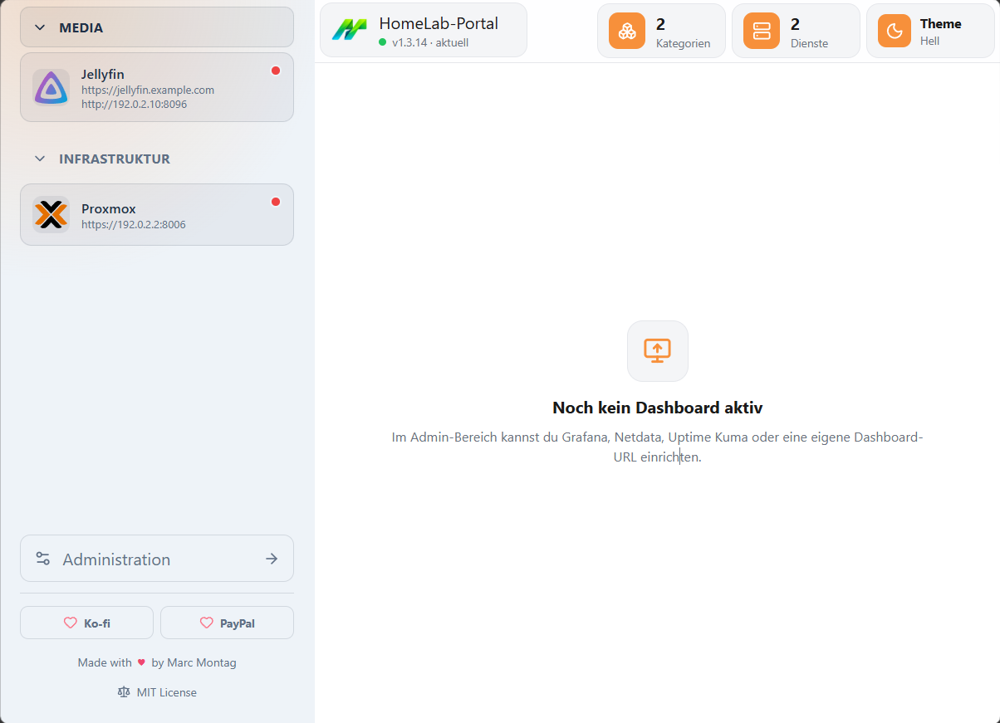
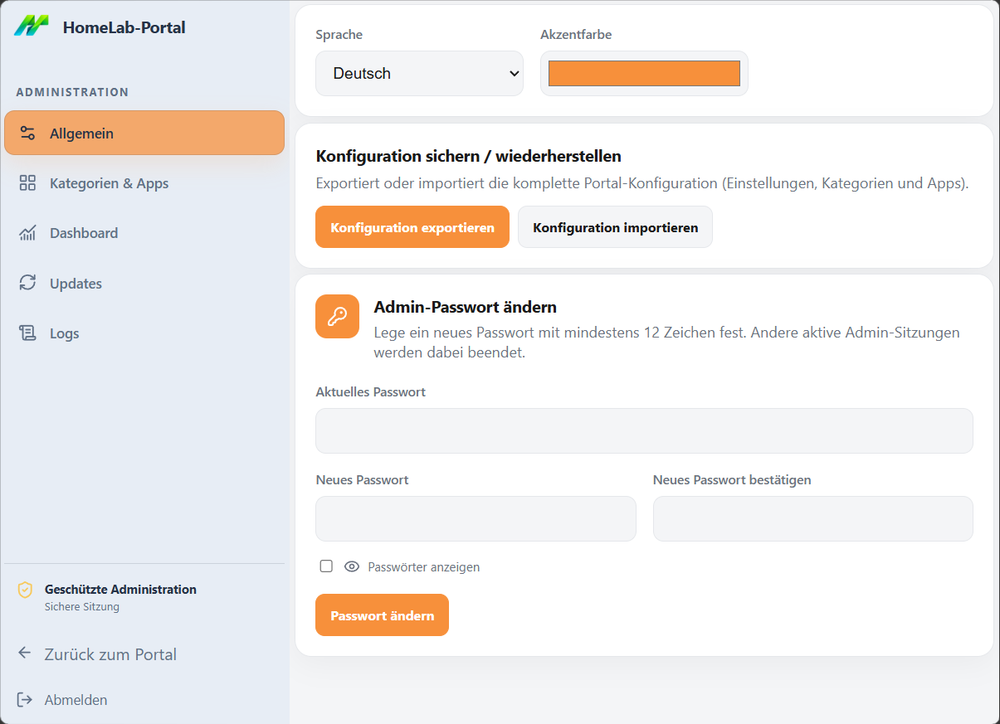

# HomeLab-Portal

HomeLab-Portal ist eine leichtgewichtige, selbst gehostete Startseite für Dienste im eigenen Homelab. Kategorien, interne und externe Adressen, Erreichbarkeitsstatus und ein optionales Grafana-Dashboard werden in einer gemeinsamen Oberfläche gebündelt.

## Funktionen

- Öffentliche Portalansicht mit Kategorien und Dienststatus
- Geschützter Admin-Bereich für Kategorien, Apps und Einstellungen
- Lokaler Icon-Katalog sowie eigene Icon-URLs
- Helles und dunkles Theme direkt im Portal
- Deutsch und Englisch
- Optional eingebettetes Grafana-Dashboard
- Konfigurationsimport und -export
- Updateprüfung, Logverwaltung und automatische Logrotation
- Betrieb mit Docker Compose oder als Proxmox-LXC

## Screenshots

### Portal



### Administration



## Schnellstart mit Docker

Voraussetzungen: Docker Engine und Docker Compose.

```bash
git clone https://github.com/montag-labs/HomeLab-Portal.git
cd HomeLab-Portal
mkdir -p server/data/logs
```

Auf Linux benötigt das eingebundene Datenverzeichnis Schreibrechte für UID/GID `1000:1000`:

```bash
sudo chown -R 1000:1000 server/data
```

Eine nicht versionierte Datei `.env` anlegen:

```dotenv
ADMIN_PASSWORD=ein-langes-zufaelliges-passwort
```

Container starten:

```bash
docker compose up -d
```

- Portal: <http://localhost:4000>
- Administration: <http://localhost:4000/admin>

Das Image `montaglabs/homelab-portal:latest` wird automatisch von Docker Hub geladen. Konfiguration, Admin-Passwort und Logs bleiben unter `server/data` erhalten.

Details zu Umgebungsvariablen, Updates, Backups und Reverse Proxy stehen in der [Docker-Dokumentation](docs/docker.md).

## Schnellstart im Proxmox-LXC

Voraussetzungen: ein Debian- oder Ubuntu-LXC mit Root-Zugriff, mindestens 1 vCPU, 512 MB RAM und 4 GB Speicher.

Das Installationsscript kann vorab unter [scripts/install-lxc.sh](scripts/install-lxc.sh) geprüft und anschließend im LXC ausgeführt werden:

```bash
bash -c "$(curl -fsSL https://raw.githubusercontent.com/montag-labs/HomeLab-Portal/main/scripts/install-lxc.sh)"
```

Das Script installiert Node.js 26, erstellt einen unprivilegierten Dienstbenutzer, baut die Anwendung und richtet Service, Updatepfad und Logrotation ein. Der vorgeschlagene Standardport ist `80`.

Das automatisch erzeugte Admin-Passwort anzeigen:

```bash
sudo cat /var/lib/homelab-portal/admin-password
```

- Portal: `http://<LXC-IP>`
- Administration: `http://<LXC-IP>/admin`

Ports, Parameter, Updates und Fehlerdiagnose sind in der [LXC-Dokumentation](docs/lxc.md) beschrieben.

## Dokumentation

- [Docker-Betrieb](docs/docker.md)
- [LXC-Betrieb](docs/lxc.md)
- [Konfiguration und Grafana](docs/configuration.md)
- [Updates, Logs, Backups und Betrieb](docs/operations.md)
- [Entwicklung und Releases](docs/development.md)
- [Sicherheitsrichtlinie](SECURITY.md)
- [Beitragen](CONTRIBUTING.md)
- [Änderungsverlauf](CHANGELOG.md)

## Unterstützung

- [Projekt über Ko-fi unterstützen](https://ko-fi.com/E6F725OFMG)
- [Projekt über PayPal unterstützen](https://www.paypal.com/donate/?hosted_button_id=AAWND2KK9V22G)

## Lizenz

HomeLab-Portal steht unter der [MIT-Lizenz](LICENSE).
